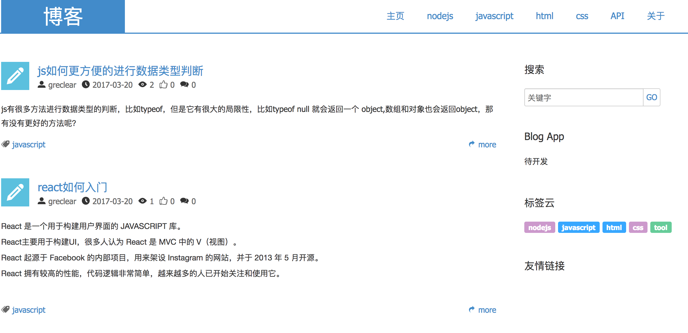
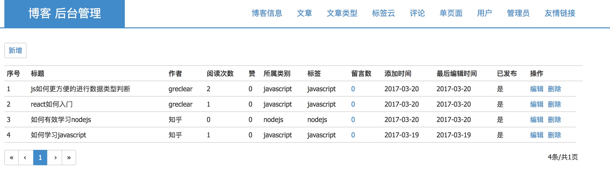

# Blog

### 前言

后端：node + express + co + mongoose + ...  
前端：react + redux + react-router + react-redux + ...  

### 准备

安装 nodejs(>=4) 和 mongodb(且启动)
window用户需要先安装ruby环境，再安装sass，如果需要安装node-sass，因为需要node-gyp编译，所以还需要安装python环境
### 运行

    git clone https://github.com/greclear/blog.git  // 仓库
    // 后端be
    cd be && npm install  // 安装
    npm start  // 启动
    // 前端fe
    cd fe && npm install  // 安装（可能有点慢）
    npm run build.dev // 打包客户端JS
    npm start  // 启动

    //单纯的前端开发，启用热加载和redux-devtools
    npm run watch //启动

### 说明

1.访问地址

    http://localhost:3004  // 前台地址
    http://localhost:3004/admin  // 后台地址(初始账号: admin@blog.com , 密码: admin )
    http://localhost:3005  // 单纯前端热加载地址

2.几个config文件

    /be/config/  //后端配置文件（数据库、session、host、port等）
    /be/controllers //后端的CRUD
    /be/models //数据库的表结构

    /fe/src/config/  // 前端配置文件（后台访问目录路径、host、port等）
    /fe/build/  //一部分是webpack配置打包文件，一部分是前端页面开发阶段的热加载文件
    /fe/resource  //静态资源和打包资源等文件

### 待优化

1.abort正在进行的ajax请求  
2.ImmutableJS的引入

### 更新日志

**0.1.0（2017-03-15）**  

blog前后端代码彻底分离fe/be，后端基于express + co + mongoose，前端基于react + redux + react-router，前后端同构
服务一分为2（apiServer + renderServer），对renderServer实现前后端同构，首次加载走服务端，脚本加载后走客户端。

**实现基本功能有:**

1.文章发布  
2.文章分类自定义  
3.文章搜索  
4.文章留言  
5.单页面   
6.标签云  
7.友情链接和后台管理等
